# Colab 을 vscode 에서 연결하여 사용하는 방법 (macOS 기준)

## 1. __Colab__ 에서 수행할 내용
1. Colab 을 열어 새 ipynb 만들기

2. 새 ipynb 에서 GPU 사용 설정하기 
 
    상단의 메뉴표시줄 에서 아래의 메뉴를 선택하여 GPU 설정을 완료한다.

    > 수정 > 노트 설정 > 하드웨어 가속기 > ___GPU___

3. 아래의 코드를 순차적으로 실행하기
   1. python 에 ___colab-ssh___ package 설치하기
   2. google drive 를 해당 ipynb 에 연동하기
   3. password 를 설정한 후, colab ssh 실행하기

    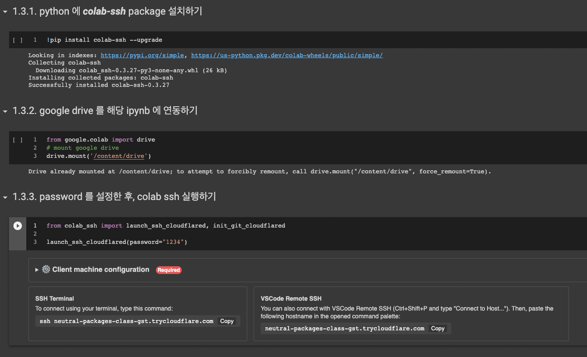</img>

4. 마지막 코드가 실행되고 난 후, 생성된 ___VSCode Remote SSH___ code 를 복사하기

    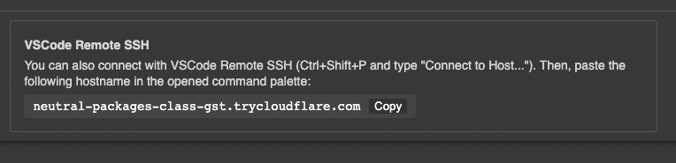</img>

---

## 2. __내 컴퓨터__ 에서 수행할 내용
1. 내 컴퓨터에 ___cloudflare___ package 를 설치하기

    만약 ___brew___ package가 설치되어 있지 않다면, 아래의 command 를 실행하여 ___brew___ 를 먼저 설치한다. (참고: https://brew.sh/index_ko)
    > $ /bin/bash -c "$(curl -fsSL https://raw.githubusercontent.com/Homebrew/install/HEAD/install.sh)"

    Terminal 에서 아래의 command 를 실행하여 ___cloudflare___ 를 설치한다.
    > $ brew install cloudflare/cloudflare/cloudflared

2. vscode 를 열어, 필요한 ___extensions___ 설치하기

   1. 좌측면에 아이콘 중 extensions 아이콘 (정사각형 4개가 있는 아이콘) 을 눌러 (또는 shift + command + X 키를 눌러), extensions 창으로 이동하기

      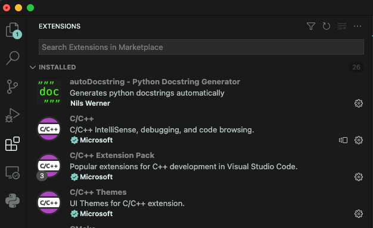</img>

   2. 검색창에 ___Remote - SSH___ 를 입력하여 검색하고 설치하기

      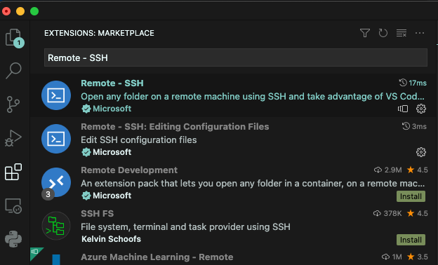</img>

3. 상단 메뉴표시줄 에서 아래의 메뉴를 선택하여 (또는 shift + command + P 키를 눌러) pallete 창 열기
    > View > Command Pallete...

    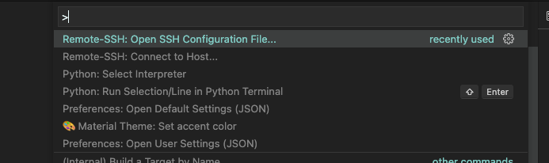</img>

4. 상단에 표시된 pallete command 창에 아래의 command 를 실행하여 configuration file 열기
    > \> Remote-SSH: Open SSH Configuration File...

    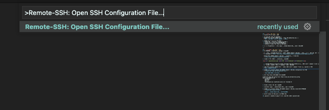</img>

    > /User/[USER NAME]/.ssh/config

    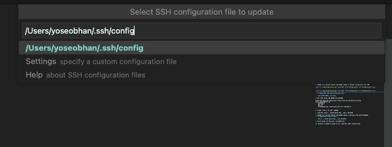</img>

5. 새로 열린 config 창에 아래의 내용 입력하기
    ```
    # Read more about SSH config files: https://linux.die.net/man/5/ssh_config
    Host *.trycloudflare.com
        HostName %h
        User root
        Port 22
        ProxyCommand exec cloudflared access ssh --hostname %h
    ```

    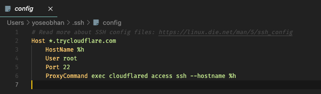</img>

6. Vscode 를 종료한 후, 다시 시작하기

7. Colab 에서 생성된 ___VSCode Remote SSH___ code 를 복사하기

    </img>

8. 상단에 표시된 pallete command 창에 아래의 command 를 실행하여 Colab SSH 에 연결하기
    > View > Command Pallete...

    </img>

    > \> Remote-SSH: Connect to Host...

    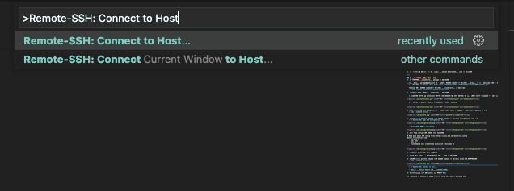</img>

    > [복사한 ___VSCode Remote SSH___ code 붙여넣기]

    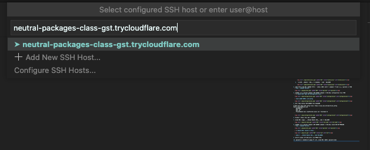</img>

9. 새로운 vscode 창이 실행되면서 ssh 연결이 수행

10. password 를 입력하라는 popup 이 뜨면, colab 에서 설정한 password 입력

    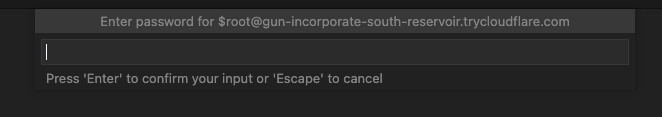</img>
  
11. ssh 연결이 완료되면, vscode 의 좌측하단에 아래의 그림과 같은 표기 확인

    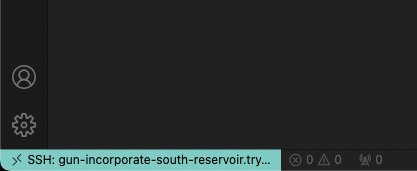</img>
  
12. Ternminal 에서 GPU 정보를 확인하기
    1. 아래의 메뉴를 순차적으로 눌러 (또는 ctrl + ` 키 를 눌러) Terminal 창 열기 
    > View > Terminal 

    2. Terminal 창에서 아래와 같은 command 를 입력하여 GPU 정보를 확인
    > $ nvidia-smi

    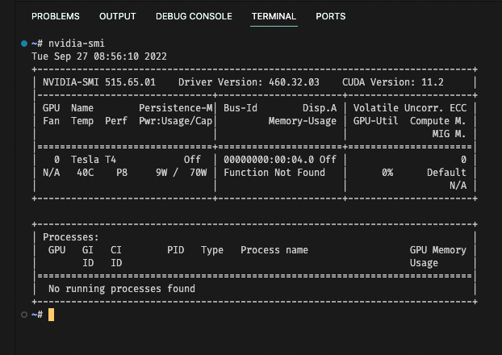</img>
  
13. Ternminal 에서 google drive 파일을 확인하기
    1. 아래의 메뉴를 순차적으로 눌러 (또는 ctrl + ` 키 를 눌러) Terminal 창 열기 
    > View > Terminal 

    2. Terminal 창에서 아래와 같은 command 를 입력하여 GPU 정보를 확인
    > $ cd /content/drvie/MyDrive

    > $ ls


    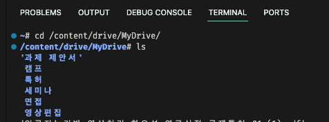</img>
  